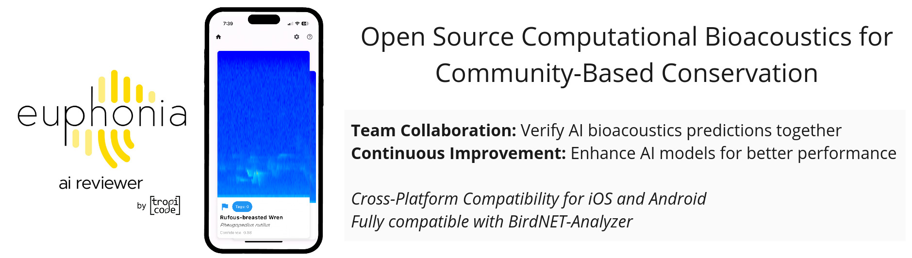

    

# Welcome!

**Euphonia AI Reviewer** is an open-source app designed to reduce the participation threshold in bioacoustics AI-powered research and promote inclusivity and accessibility. It allows researchers and citizen scientists to easily review and verify AI predictions, fostering community-based conservation and democratizing science.

The app allows users to swipe right or left (yes, just like Tinder) to verify AI bioacoustics predictions as correct or incorrect, respectively. Additionally, users can swipe down if they are unsure of the label.

Admins have the capability to upload more predictions for verification and download the verified data to further refine their AI models.
